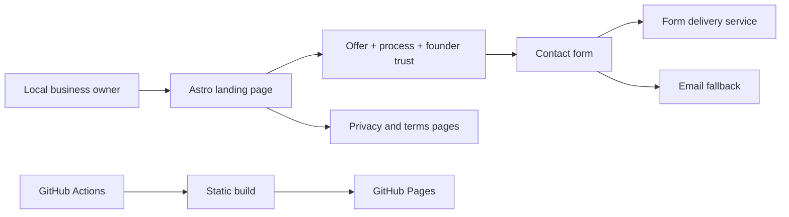

## Goal
Launch a truthful, distinctive, responsive Linda Della Industries landing site that converts Baltimore/DMV business owners into conversations for one $1,000 founding AI Workflow Sprint.

## Starting point
Fresh git repository. No inherited production code. Prior Linda Della work in `wtergan.site` is context only and must not be copied.

## Non-goals
- Building the future software/research/hardware product portfolio now
- Claiming customers, outcomes, certifications, or compliance not yet earned
- Creating a custom domain without a reputable registrable option
- Implementing regulated or sensitive-data client systems in this launch
- Broad CRM, auth, billing, or multi-tenant platform work

## Decision boundaries
- Static-first Astro site to keep launch fast and free to host.
- GitHub Pages is the default free deployment path because `gh` is authenticated; use its project subdomain until a domain is purchased.
- Contact uses a minimal third-party form endpoint with visible email fallback and no committed secrets. Activation/manual confirmation may remain a launch dependency.

## Architecture

## Worktree session
The repository itself is new and isolated; no secondary worktree is needed for the initial launch.

## Execution
1. Finish source-backed market and competitor research.
2. Lock one offer, audience, scope, price, CTA, and honest founder positioning.
3. Scaffold Astro + TypeScript with static output and GitHub Pages config.
4. Implement accessible responsive pages, original CSS/SVG brand system, and contact flow.
5. Add metadata, structured data, privacy/terms, 404, sitemap/robots, and deployment workflow.
6. Add Playwright behavior tests with `[condition]-should-[expected]` titles.
7. Run checks/build/tests and inspect 375px + 1440px screenshots.
8. Review against current Vercel Web Interface Guidelines and fix blocking findings.
9. Create public GitHub repository, deploy Pages, and verify the live URL. If form activation blocks end-to-end delivery, document the single user action precisely.
10. Write a concise Obsidian project rollup and seven-day sales sprint.

## Verification contract
- `npm run check`
- `npm run build`
- `npm run test:e2e`
- no console errors or failed same-origin assets
- no horizontal overflow at 375px or 1440px
- usable keyboard navigation and visible focus
- reduced-motion mode disables nonessential movement
- all public claims trace to founder evidence or cited primary sources
- live URL returns 200 and core CTA is reachable

## Approval boundaries
The user explicitly requested a fresh project, website, backend/contact path, and free deployment. Do not buy a domain, spend money, enroll in paid services, publish social posts, send sales outreach, or create client-facing accounts without separate approval.

## Stop conditions
Stop only on verified launch, explicit cancellation, or a blocker requiring the user to authenticate/activate an external service.
